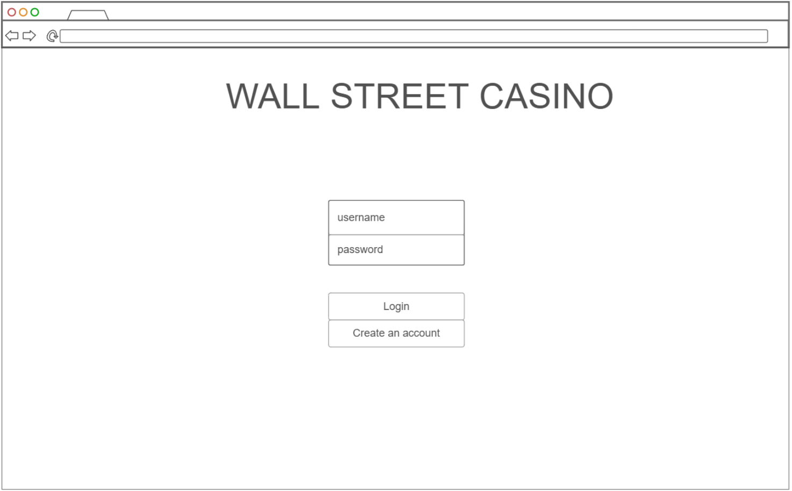
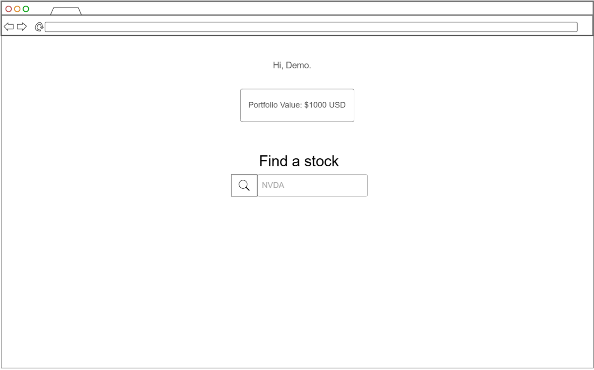
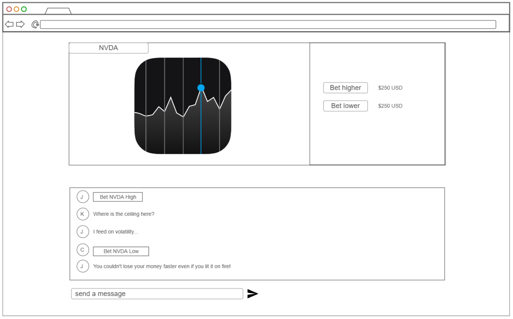
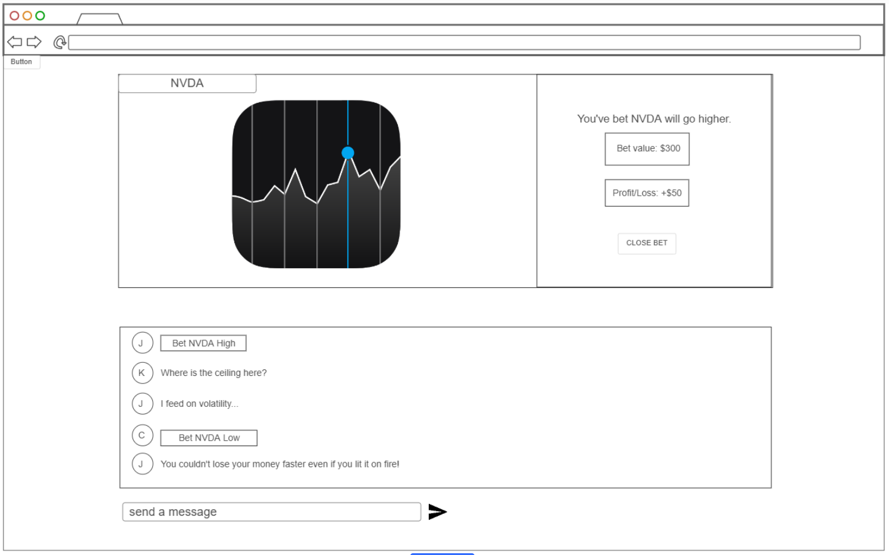
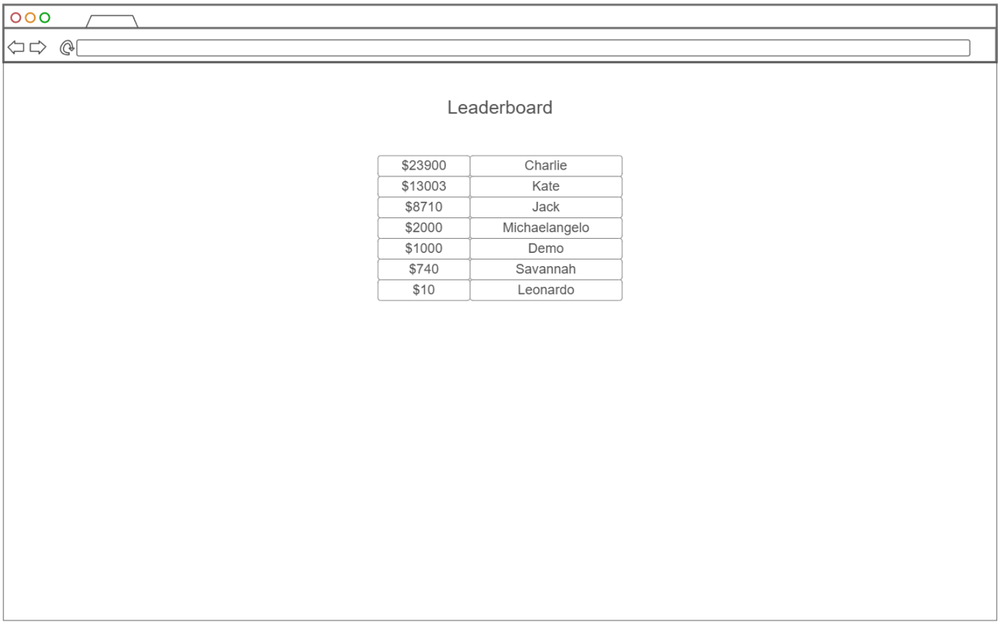
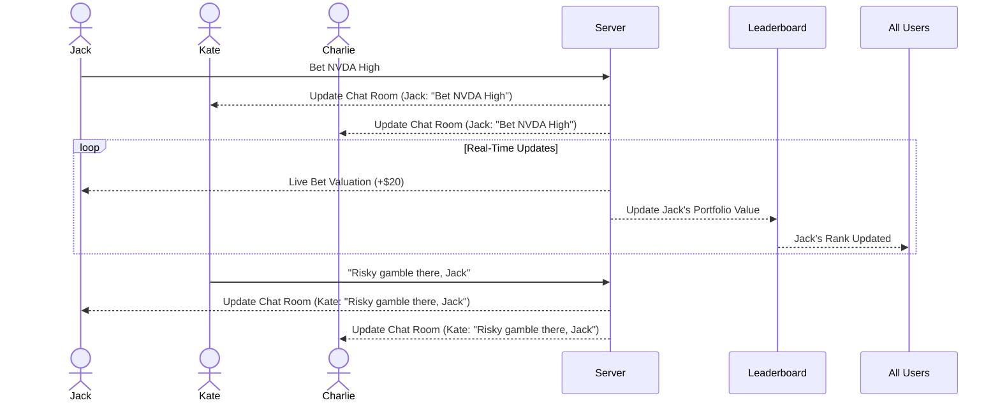

# Wall Street Casino

[My Notes](notes.md)

Wall Street Casino is a simple web based application for betting on live stock market movements using virtual monopoly money.

> [!NOTE]
>  This is a template for your startup application. You must modify this `README.md` file for each phase of your development. You only need to fill in the section for each deliverable when that deliverable is submitted in Canvas. Without completing the section for a deliverable, the TA will not know what to look for when grading your submission. Feel free to add additional information to each deliverable description, but make sure you at least have the list of rubric items and a description of what you did for each item.

> [!NOTE]
>  If you are not familiar with Markdown then you should review the [documentation](https://docs.github.com/en/get-started/writing-on-github/getting-started-with-writing-and-formatting-on-github/basic-writing-and-formatting-syntax) before continuing.

## 🚀 Specification Deliverable

> [!NOTE]
>  Fill in this sections as the submission artifact for this deliverable. You can refer to this [example](https://github.com/webprogramming260/startup-example/blob/main/README.md) for inspiration.

For this deliverable I did the following. I checked the box `[x]` and added a description for things I completed.

- [X] Proper use of Markdown - Followed format in example.
- [X] A concise and compelling elevator pitch - Described the exciting social and live aspects of the app.
- [X] Description of key features - Described chat rooms, placing bets, viewing leaderboard, etc.
- [X] Description of how you will use each technology - Explained React compenents for the UI, backend services for handling portfolio and bet data, websockets for chat and market updates.
- [X] One or more rough sketches of your application. Images must be embedded in this file using Markdown image references. - Used Ninjamock.io for a simple mockup.

### Elevator pitch

How much money can you make (or lose) by timing the market compared to time in the market? Wall Street Casino offers a platform where users can bet on live stock market movements using virtual currency. Users can view real-time market performance, chat with others, and size their bets. For each stock, users can enter a chat room with a 1 minute line chart of the selected security and view the betting status of other members. Their total winnnings and losses are reflected in the app leaderboard. 

### Design

This sequence diagram demonstrates how a bet is placed and broadcasted to the chat room then updated on the leaderboard. It also shows how a chat message is broadcasted.

### Key features

- Secure login over HTTPS
- View current portfolio valuation (preset is $1000 USD in cash)
- Search and select a stock to view
- Upon viewing a stock, enter a chat room
- Send messages viewable by users within a chat room in real time
- Upon viewing a stock, purchase a "Higher" or "Lower" bet using their funds using a modal
- User can view the live valuation of a current bet (based on the degree of movement of the underlying security) under the line chart
- User may close their bet for a profit or loss
- A leaderboard page where all user portfolios are ranked in real time
- Persistent storage of portfolio values

### Technologies

I am going to use the required technologies in the following ways.

- **HTML** - Correct HTML usage to create 5 pages:
    - For login,
    - For viewing personal portfolios,
    - For browsing through stocks,
    - For viewing the stock line chart and chat room (stock chart on top half, chat on bottom)
    - For purchasing and selling bets (modal)
- **CSS** - Consistent formatting, modularization of CSS elements, and readable styling will produce a simple yet clean and intuitive layout.
- **React** - Login form, viewing current portfolio, browsing and selecting a stock, rendering stock line chart and chat room, rendering bet purchase/sell modal, viewing leaderboard
- **Service** - Endpoints include:
    - Login authentication
    - Portfolio retrieval
    - Purchasing bets
    - Selling bets
    - Viewing live bet status
    - Stock data retrieval
    - Chat and chat messages 
- **DB/Login** - Register and login users; store bets; store leaderboard data
- **WebSocket** - Enable live chat, leaderboard rankings, and market data + bet valuations (using an API such as Polygon.io)

## 🚀 AWS deliverable

For this deliverable I did the following. I checked the box `[x]` and added a description for things I completed.

- [X] **Server deployed and accessible with custom domain name** - [My server link](https://wallstreetcasino.click).

## 🚀 HTML deliverable

For this deliverable I did the following. I checked the box `[x]` and added a description for things I completed.

- [X] **HTML pages** - Structured 4 base pages for portfolios, stock charts, leaderboard, and home/login page.
- [X] **Proper HTML element usage** - Used proper HTML conventions to organize elements semantically.
- [X] **Links** - Links to each page are avalaible on the top navigation dashboard.
- [X] **Text** - Included in all areas of the application.
- [X] **3rd party API placeholder** - Stock chart references Polygon.io; stock query with search button will also incorporate this API.
- [X] **Images** - Stock analysis placeholder chart included on stock page.
- [X] **Login placeholder** - Complete with password input and login + signup buttons.
- [X] **DB data placeholder** - Portfolio values, chat messages, and bet valuations all represent persistently stored data.
- [X] **WebSocket placeholder** - Live security daily performance data, chat messages, and stock symbol queries imply real-time updates.
## 🚀 CSS deliverable

For this deliverable I did the following. I checked the box `[x]` and added a description for things I completed.

- [X] **Header, footer, and main content body** - Constructed vertically with an unobstructed flow of content in between.
- [X] **Navigation elements** - Responsive, styled, and functional dashboard.
- [X] **Responsive to window resizing** - Media orientation queries configured and functional.
- [X] **Application elements** - Organized and styled properly with CSS classes.
- [X] **Application text content** - Organized, aligned and styled within proper HTML tags.
- [X] **Application images** - Placeholder images, github logo, and favicon.

## 🚀 React part 1: Routing deliverable

For this deliverable I did the following. I checked the box `[x]` and added a description for things I completed.

- [X] **Bundled using Vite** - Vite installed; bundles performed via Vite through dependency imports.
- [X] **Components** - Components for main App, Login, Stock, Leaderboard, and Portfolio defined and implemented. 
- [X] **Router** - Routing enables linkage between aforementioned components through React Router.

## 🚀 React part 2: Reactivity

For this deliverable I did the following. I checked the box `[x]` and added a description for things I completed.

- [X] **All functionality implemented or mocked out** - Mock stock symbol queries, live stock price and bet valuation updates, websocket chat messages, leaderboard live rankings.
- [X] **Hooks** - useEffect, useState, and useNavigate for almost every component.

## 🚀 Service deliverable

For this deliverable I did the following. I checked the box `[x]` and added a description for things I completed.

- [X] **Node.js/Express HTTP service** - Routing, middleware, and request handling performed with Express framework and Node.js runtime.
- [X] **Static middleware for frontend** - Used built-in Express middleware and Vite to serve up static files.
- [X] **Calls to third party endpoints** - Many endpoints to Polygon.io.
- [X] **Backend service endpoints** - Routes for authentication, stock rooms, and portfolio using the express.Router() handler, async/await and and Node fetch.
- [X] **Frontend calls service endpoints** - Calls in every component to backend service endpoints using async/await and Node fetch.

## 🚀 DB/Login deliverable

For this deliverable I did the following. I checked the box `[x]` and added a description for things I completed.

- [X] **User registration** - User credentials hashed and persistently stored in NoSQL database (Mongo).
- [X] **User login and logout** - Provided credentials queried + authentication created upon successful logins. Token deleted upon logout.
- [X] **Stores data in MongoDB** - Portfolio values, username, and credentials stored via MongoDB's Binary JSON collections architecture.
- [X] **Stores credentials in MongoDB** - Same as above.
- [X] **Restricts functionality based on authentication** - Authentication middleware queries MongoDB for user tokens.

## 🚀 WebSocket deliverable

For this deliverable I did the following. I checked the box `[x]` and added a description for things I completed.

- [X] **Backend listens for WebSocket connection** - Polygon proxy WS and Chat WS manually upgrade HTTP requests from parsed URLs.
- [X] **Frontend makes WebSocket connection** - Client connections send HTTP request with intent to upgrade.
- [X] **Data sent over WebSocket connection** - Various stock data and user chat messages sent over WS.
- [X] **WebSocket data displayed** - Stock data displayed on charts, chat messages in chat rooms.
- [X] **Application is fully functional** - All intended functionality operating with no discovered bugs to date. 
