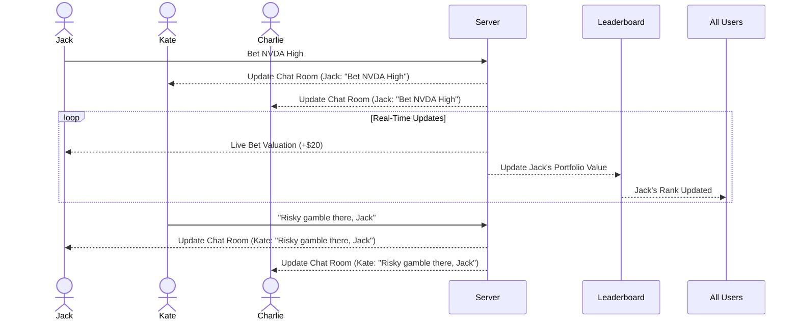

# Wall Street Casino

[My Notes](notes.md)

Wall Street Casino is a simple web based application for betting on live stock market movements using virtual monopoly money.

> [!NOTE]
>  This is a template for your startup application. You must modify this `README.md` file for each phase of your development. You only need to fill in the section for each deliverable when that deliverable is submitted in Canvas. Without completing the section for a deliverable, the TA will not know what to look for when grading your submission. Feel free to add additional information to each deliverable description, but make sure you at least have the list of rubric items and a description of what you did for each item.

> [!NOTE]
>  If you are not familiar with Markdown then you should review the [documentation](https://docs.github.com/en/get-started/writing-on-github/getting-started-with-writing-and-formatting-on-github/basic-writing-and-formatting-syntax) before continuing.

## 🚀 Specification Deliverable

> [!NOTE]
>  Fill in this sections as the submission artifact for this deliverable. You can refer to this [example](https://github.com/webprogramming260/startup-example/blob/main/README.md) for inspiration.

For this deliverable I did the following. I checked the box `[x]` and added a description for things I completed.

- [X] Proper use of Markdown
- [X] A concise and compelling elevator pitch
- [X] Description of key features
- [X] Description of how you will use each technology
- [X] One or more rough sketches of your application. Images must be embedded in this file using Markdown image references.

### Elevator pitch

How much money can you make (or lose) by timing the market compared to time in the market? Wall Street Casino offers a platform where users can bet on live stock market movements using virtual currency. Users can view real-time market performance, chat with others, and size their bets. For each stock, users can enter a chat room with a 1 minute line chart of the selected security and view the betting status of other members. Their total winnnings and losses are reflected in the app leaderboard. 

### Design

This sequence diagram demonstrates how a bet is placed and broadcasted to the chat room and updated on the leaderboard, as well as a chat room message.

### Key features

- Secure login over HTTPS
- View current portfolio valuation (preset is $1000 USD in cash)
- Search and select a stock to view
- Upon viewing a stock, enter a chat room
- Send messages viewable by users within a chat room in real time
- Upon viewing a stock, purchase a "Higher" or "Lower" bet using their funds using a modal
- User can view the live valuation of a current bet (based on the degree of movement of the underlying security) under the line chart
- User may close their bet for a profit or loss
- A leaderboard page where all user portfolios are ranked in real time
- Persistent storage of portfolio values

### Technologies

I am going to use the required technologies in the following ways.

- **HTML** - Correct HTML usage to create 5 pages:
    - For login,
    - For viewing personal portfolios,
    - For browsing through stocks,
    - For viewing the stock line chart and chat room (stock chart on top half, chat on bottom)
    - For purchasing and selling bets (modal)
- **CSS** - Consistent formatting, modularization of CSS elements, and readable styling will produce a simple yet clean and intuitive layout.
- **React** - Login form, viewing current portfolio, browsing and selecting a stock, rendering stock line chart and chat room, rendering bet purchase/sell modal, viewing leaderboard
- **Service** - Endpoints include:
    - Login authentication
    - Portfolio retrieval
    - Purchasing bets
    - Selling bets
    - Viewing live bet status
    - Stock data retrieval
    - Chat and chat messages 
- **DB/Login** - Register and login users; store bets; store leaderboard data
- **WebSocket** - Enable live chat, leaderboard rankings, and market data + bet valuations (using an API such as Polygon.io)

## 🚀 AWS deliverable

For this deliverable I did the following. I checked the box `[x]` and added a description for things I completed.

- [ ] **Server deployed and accessible with custom domain name** - [My server link](https://yourdomainnamehere.click).

## 🚀 HTML deliverable

For this deliverable I did the following. I checked the box `[x]` and added a description for things I completed.

- [ ] **HTML pages** - I did not complete this part of the deliverable.
- [ ] **Proper HTML element usage** - I did not complete this part of the deliverable.
- [ ] **Links** - I did not complete this part of the deliverable.
- [ ] **Text** - I did not complete this part of the deliverable.
- [ ] **3rd party API placeholder** - I did not complete this part of the deliverable.
- [ ] **Images** - I did not complete this part of the deliverable.
- [ ] **Login placeholder** - I did not complete this part of the deliverable.
- [ ] **DB data placeholder** - I did not complete this part of the deliverable.
- [ ] **WebSocket placeholder** - I did not complete this part of the deliverable.

## 🚀 CSS deliverable

For this deliverable I did the following. I checked the box `[x]` and added a description for things I completed.

- [ ] **Header, footer, and main content body** - I did not complete this part of the deliverable.
- [ ] **Navigation elements** - I did not complete this part of the deliverable.
- [ ] **Responsive to window resizing** - I did not complete this part of the deliverable.
- [ ] **Application elements** - I did not complete this part of the deliverable.
- [ ] **Application text content** - I did not complete this part of the deliverable.
- [ ] **Application images** - I did not complete this part of the deliverable.

## 🚀 React part 1: Routing deliverable

For this deliverable I did the following. I checked the box `[x]` and added a description for things I completed.

- [ ] **Bundled using Vite** - I did not complete this part of the deliverable.
- [ ] **Components** - I did not complete this part of the deliverable.
- [ ] **Router** - Routing between login and voting components.

## 🚀 React part 2: Reactivity

For this deliverable I did the following. I checked the box `[x]` and added a description for things I completed.

- [ ] **All functionality implemented or mocked out** - I did not complete this part of the deliverable.
- [ ] **Hooks** - I did not complete this part of the deliverable.

## 🚀 Service deliverable

For this deliverable I did the following. I checked the box `[x]` and added a description for things I completed.

- [ ] **Node.js/Express HTTP service** - I did not complete this part of the deliverable.
- [ ] **Static middleware for frontend** - I did not complete this part of the deliverable.
- [ ] **Calls to third party endpoints** - I did not complete this part of the deliverable.
- [ ] **Backend service endpoints** - I did not complete this part of the deliverable.
- [ ] **Frontend calls service endpoints** - I did not complete this part of the deliverable.

## 🚀 DB/Login deliverable

For this deliverable I did the following. I checked the box `[x]` and added a description for things I completed.

- [ ] **User registration** - I did not complete this part of the deliverable.
- [ ] **User login and logout** - I did not complete this part of the deliverable.
- [ ] **Stores data in MongoDB** - I did not complete this part of the deliverable.
- [ ] **Stores credentials in MongoDB** - I did not complete this part of the deliverable.
- [ ] **Restricts functionality based on authentication** - I did not complete this part of the deliverable.

## 🚀 WebSocket deliverable

For this deliverable I did the following. I checked the box `[x]` and added a description for things I completed.

- [ ] **Backend listens for WebSocket connection** - I did not complete this part of the deliverable.
- [ ] **Frontend makes WebSocket connection** - I did not complete this part of the deliverable.
- [ ] **Data sent over WebSocket connection** - I did not complete this part of the deliverable.
- [ ] **WebSocket data displayed** - I did not complete this part of the deliverable.
- [ ] **Application is fully functional** - I did not complete this part of the deliverable.
